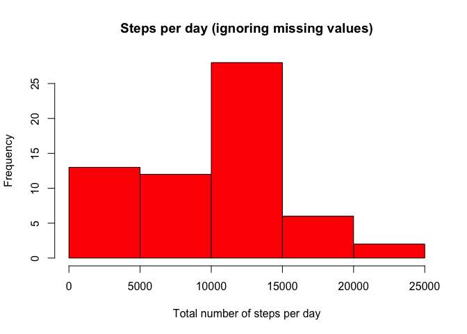
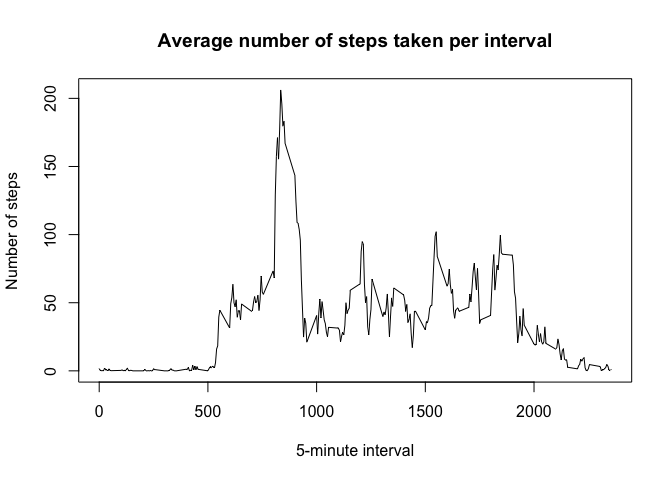
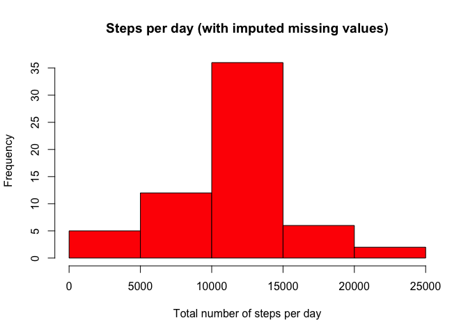
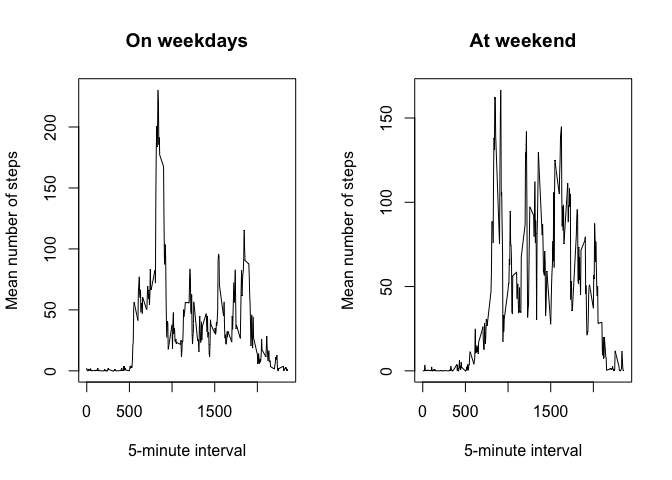

# Reproducible Research: Peer Assessment 1

This assignment makes use of data from a personal activity monitoring device.
The dataset records the total number of steps taken by an anonymous individual
at 5 minute intervals throughout the day and was collected during October and
November 2012.

## Loading and preprocessing the data
The Activity Monitoring dataset is available to download from:
https://d396qusza40orc.cloudfront.net/repdata%2F%data%2Factivity.zip

This assignment assumes that the downloaded file has been unzipped and stored
in the working directory as activity.csv.

After loading the dataset into a dataframe, it was pre-proceessed to ensure
the date information was available in date format.

```r
data <- read.table("activity.csv", header = TRUE, sep = ",")
data$date <- as.Date(data$date)
```

## What is mean total number of steps taken per day?
Although the dataset records the number of steps taken in each 5-minute
interval, a significant number of interval readings are missing and are coded
as NA. The initial analysis of the total number of steps taken per day ignores
these missing values. The following figure shows a histogram of the total
number of steps taken each day.

```r
# calculate total number of steps per day; ignore missing values
totalStepsByDate <- aggregate(data$steps, by = list(date = data$date), FUN = sum, na.rm = TRUE)
colnames(totalStepsByDate)[2] <- 'totalSteps'

# histogram plot of total number of steps per day
hist(totalStepsByDate$totalSteps,
     col = "Red",
     main = "Steps per day (ignoring missing values)",
     xlab = "Total number of steps per day")
```

 

```r
# calculate mean and median total number of steps taken per day
meanSteps <- mean(totalStepsByDate$totalSteps)
medianSteps <- median(totalStepsByDate$totalSteps)
meanSteps
```

```
## [1] 9354
```

```r
medianSteps
```

```
## [1] 10395
```

The mean of the total number of steps taken per day is 9354.23, while the
median is 10395.

## What is the average daily activity pattern?
The following time series plot shows the average number of steps taken per time
interval, when averages across all days.

```r
# calculate average number of steps taken per interval; ignore missing values
meanStepsByInterval <- aggregate(data$steps, by = list(interval = data$interval), FUN=mean, na.rm = TRUE)
colnames(meanStepsByInterval)[2] <- 'meanSteps'

# time series plot of average steps taken per 5-minute interval
with(meanStepsByInterval, plot(interval, meanSteps,
                type ="l",
                main = "Average number of steps taken per interval",
                xlab = "5-minute interval",
                ylab = "Number of steps"))
```

 

```r
# find 5-minute interval with maximum number of steps on average
sortedMeanSteps <- meanStepsByInterval[order(-meanStepsByInterval$meanSteps), ]
maxInterval <- sortedMeanSteps$interval[1]
maxInterval
```

```
## [1] 835
```
The 5-minute interval which, on average across all the days in the dataset
contains the greatest number of steps is 835.

## Imputing missing values

```r
# calculate and report the total number of missing values in the dataset
# (i.e. the total number of rows with NAs)
completeRows <- complete.cases(data)
incompleteTotal <- sum(!completeRows)
incompleteTotal
```

```
## [1] 2304
```
The total number of rows with missing data is 2304.

For the purposes of the rest of this anaylsis, the values for days with missing
intervals have been filled in using the mean number of steps calculated for
that interval over the remaining days.

```r
# create new dataset with the missing data filled in
completeData <- data
completeData <- merge(completeData, meanStepsByInterval, by = "interval")
completeData$steps[is.na(completeData$steps)] <- completeData$meanSteps[is.na(completeData$steps)]
```
The following figure shows a histogram of the total number of steps taken each
day, once the dataset has been post-processed to impute appropriate values for
those intervals with missing data.

```r
# calculate total number of steps per day; with imputed missing values
totalStepsByDate2 <- aggregate(completeData$steps, by = list(date = completeData$date), FUN = sum, na.rm = TRUE)
colnames(totalStepsByDate2)[2] <- 'totalSteps'

# plot histogram of total steps per day, with imputed missing values
hist(totalStepsByDate2$totalSteps,
     col = "Red",
     main = "Steps per day (with imputed missing values)",
     xlab = "Total number of steps per day")
```

 

```r
# calculate and report mean and median total number of steps taken per day
meanSteps2 <- mean(totalStepsByDate2$totalSteps)
medianSteps2 <- median(totalStepsByDate2$totalSteps)
meanSteps2
```

```
## [1] 10766
```

```r
medianSteps2
```

```
## [1] 10766
```
Using the complete dataset with missing values filled in, the mean of the total
number of steps taken per day is now 10766.19, while the median is now
10766.19. These compare with 9354.23 and 10395
respectively for the incomplete dataset. Imputing the missing values has resulted
in a more evenly-distributed spread of values and has also resulted in the mean
and the median being the same.

## Are there differences in activity patterns between weekdays and weekends?
The final part of the analysis looks at whether there are differences in activity
patterns between weekdays and weekends.

```r
# add new 'weekday' factor variable to complete data set
weekdaysList = c('Mon', 'Tue', 'Wed', 'Thu', 'Fri')
completeData$day <- weekdays(completeData$date, abbreviate = TRUE)
completeData$weekday <- factor(completeData$day %in% weekdaysList, levels = c(TRUE, FALSE), labels = c('weekday', 'weekend'))

# create two subsets of the data (weekday and weekend)
weekdayData <- subset(completeData, completeData$weekday == "weekday")
weekendData <- subset(completeData, completeData$weekday == "weekend")

# calculate average number of steps taken per interval (weekday and weekend)
weekdayStepsByInterval <- aggregate(weekdayData$steps, by = list(interval = weekdayData$interval), FUN=mean, na.rm = TRUE)
colnames(weekdayStepsByInterval)[2] <- 'meanSteps'

weekendStepsByInterval <- aggregate(weekendData$steps, by = list(interval = weekendData$interval), FUN=mean, na.rm = TRUE)
colnames(weekendStepsByInterval)[2] <- 'meanSteps'

# Create panel plot
par(mfrow = c(1, 2))
with(weekdayStepsByInterval, plot(interval, meanSteps,
                                  type ="l",
                                  main = "On weekdays",
                                  xlab = "5-minute interval",
                                  ylab = "Mean number of steps"))
with(weekendStepsByInterval, plot(interval, meanSteps,
                                  type ="l",
                                  main = "At weekend",
                                  xlab = "5-minute interval",
                                  ylab = "Mean number of steps"))
```

 

As can be seen in this panel plot, activity during the week is skewed towards
the 8-9am timeframe with a peak in excess of 200 steps per time interval (likely
corresponding to the time when the subject is travelling to work) while at the
weekend activity is more evenly spread throughout the day with a lower maximum
of around 150 steps per time interval (likely reflecting the less regimented
and time-bound nature of activities at the weekend).
